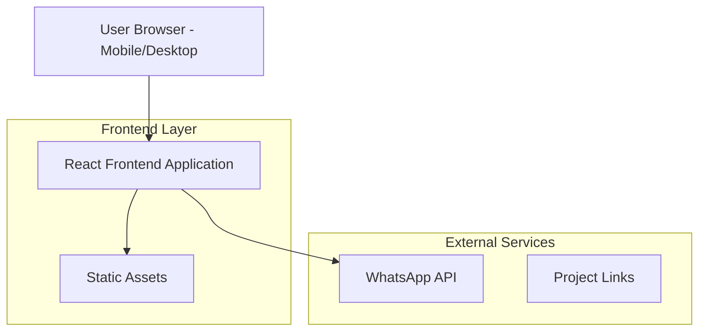

## 1. Architecture design



## 2. Technology Description
- Frontend: React@18 + tailwindcss@3 + vite
- Initialization Tool: vite-init
- Backend: None (site estático)
- Deployment: Vercel (otimizado para React/Vite)

## 3. Route definitions
| Route | Purpose |
|-------|---------|
| / | Home page completa com todas as seções (hero, sobre, projetos, serviços, diferenciais, CTA) |

## 4. Component Structure
### 4.1 Core Components
```typescript
interface Project {
  name: string;
  description: string;
  targetAudience: string;
  problemSolved: string;
  features: string[];
  link?: string;
  linkText: string;
}

interface Service {
  title: string;
  icon: string;
  description: string;
}
```

## 5. Performance Optimization
- Imagens otimizadas em formato WebP
- Lazy loading para imagens
- Code splitting automático via Vite
- CSS minificado e comprimido
- Fontes locais ou Google Fonts otimizadas
- Cache headers configurados para estáticos

## 6. Mobile-First Implementation
- Touch events otimizados
- Viewport meta tag configurado
- Font-size base 16px para mobile
- Container max-width adequado para leitura
- Scroll suave via CSS
- Menu hambúrguer com estado de abertura/fechamento

## 7. SEO e Metadados
- Meta tags dinâmicas por seção
- Schema.org para portfolio pessoal
- Open Graph tags para redes sociais
- Sitemap.xml automático
- Robots.txt configurado

## 8. Analytics e Tracking
- Google Analytics 4 integrado
- Event tracking para cliques em projetos
- Conversion tracking para contato via WhatsApp
- Performance monitoring via Vercel Analytics