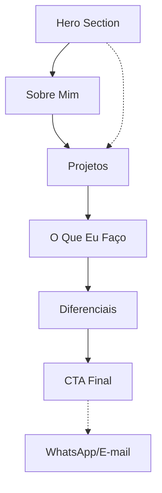

## 1. Product Overview
Site de portfólio profissional para Daniel Melo - Desenvolvedor de Sistemas e Suporte em Redes/TI. O site tem como objetivo atrair trabalhos freelance, parcerias e referências profissionais através da demonstração de projetos reais e soluções digitais desenvolvidas.

O produto resolve o problema de apresentação profissional online, conectando potenciais clientes com o portfólio de sistemas desenvolvidos, focando em mobile-first e conversão.

## 2. Core Features

### 2.1 User Roles
Este produto não requer distinção de papéis de usuário - é um site público de apresentação.

### 2.2 Feature Module
O portfólio consiste nos seguintes elementos principais:
1. **Página inicial completa**: Hero section, sobre mim, projetos, serviços, diferenciais e CTA final
2. **Navegação mobile**: Menu hambúrguer otimizado para touch
3. **Seção de projetos**: Cards verticais com links para sistemas ao vivo
4. **Formulário de contato**: Integração com WhatsApp e e-mail

### 2.3 Page Details
| Page Name | Module Name | Feature description |
|-----------|-------------|---------------------|
| Home page | Hero section | Apresenta headline "Transformo problemas operacionais em sistemas digitais eficientes" com subtítulo de Suporte em Redes TI + Desenvolvimento de Sistemas. Contém botões "Ver Projetos" (scroll) e "Falar Comigo" (link externo) |
| Home page | Sobre Mim | Texto em blocos curtos sobre experiência em suporte de redes/TI, desenvolvimento de sistemas a partir de problemas reais, análise de dados e automação |
| Home page | Projetos | Exibe 5 projetos principais em cards verticais (Kid+, SomaAI, PrecificaAI, Sistema OS, Dashboard Médico) com nome, descrição, funcionalidades e botão "Ver Sistema" com links reais |
| Home page | O Que Eu Faço | Cards responsivos com ícones listando: desenvolvimento de sistemas sob medida, dashboards, automação, sistemas internos, suporte em redes/TI |
| Home page | Diferenciais | Lista curta mobile-friendly: entendimento do problema antes do código, experiência prática, sistemas funcionais/escaláveis, comunicação clara |
| Home page | CTA Final | Texto "Tem um problema operacional que pode virar sistema?" com botão grande "Vamos conversar" |
| Home page | Navegação | Menu mobile hambúrguer com links para seções da página (smooth scroll) |

## 3. Core Process
O usuário acessa o site através de dispositivo móvel ou desktop. A página carrega com hero section impactante. O usuário pode:
1. Clicar em "Ver Projetos" para rolar até a seção de cases
2. Explorar cada projeto clicando em "Ver Sistema" (abre em nova aba)
3. Ler sobre os serviços e diferenciais
4. Clicar em "Vamos conversar" para iniciar contato via WhatsApp

## 4. User Interface Design

### 4.1 Design Style
- **Cores**: Dark mode como padrão - primário: gray-900 (#111827), secundário: blue-600 (#2563eb), acentos: emerald-500 (#10b981)
- **Botões**: Grandes (min-height 48px), cantos arredondados, cores contrastantes, fáceis de tocar
- **Tipografia**: Fonte sans-serif moderna (Inter/Roboto), títulos grandes no mobile (text-3xl mínimo), texto corporal legível (text-base mínimo)
- **Layout**: Card-based vertical, espaçamento generoso (gap-6 mínimo), container com padding adequado para mobile
- **Ícones**: Estilo line-icon moderno, consistente em todo o site
- **Animações**: Scroll reveal suave, hover effects leves, sem prejudicar performance mobile

### 4.2 Page Design Overview
| Page Name | Module Name | UI Elements |
|-----------|-------------|-------------|
| Hero section | Container full-width | Background gradient dark, headline em texto branco grande (text-4xl mobile), subtítulo menor (text-xl), dois botões grandes empilhados verticalmente no mobile |
| Projetos | Cards grid | Cards verticais empilhados (1 por linha mobile), imagem placeholder, título do projeto em negrito, descrição em texto claro, lista de funcionalidades em bullets, botão "Ver Sistema" destacado |
| Serviços | Icon cards | Grid de cards com ícone grande no topo, título do serviço, 3 colunas no desktop, 1 coluna no mobile |
| Navegação | Mobile menu | Hambúrguer icon no canto superior direito, menu slide from right, links grandes fáceis de tocar, fundo escuro semi-transparente |

### 4.3 Responsiveness
Mobile-first absoluto - todo o design começa do mobile e adapta para desktop. Breakpoints: mobile (< 640px), tablet (640-1024px), desktop (> 1024px). Touch targets mínimos de 48px, fontes escaláveis, imagens otimizadas para mobile, performance priorizada para conexões 3G/4G.